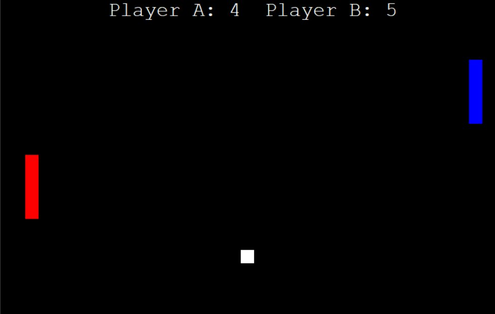

# Arcade Ping-Pong Game 🏓

A smooth, two-player Pong clone built with Python's `turtle` graphics library. This project demonstrates core game development concepts including physics logic, collision detection, and event-driven programming.

## 🚀 Features
- **Local Multiplayer:** Side-by-side competition on a single keyboard.
- **Dynamic Physics:** Precise collision detection for paddles and screen boundaries.
- **Optimized Performance:** Uses `tracer(0)` for flicker-free, smooth movement.
- **Refactored Code:** Implements DRY principles using modular functions and lambda expressions.
- **Real-Time Score Tracking:** Automatically tracks and displays scores for both players at the top of the screen.



## 🛠️ Built With
- **Language:** Python 3.x
- **Library:** Turtle (Standard Library)

## 🎮 How to Play

### Installation
1. Ensure you have [Python](https://www.python.org/) installed.
2. Clone this repository or download the `pong.py` file.
3. Run the game using:
   ```bash
   python pong.py